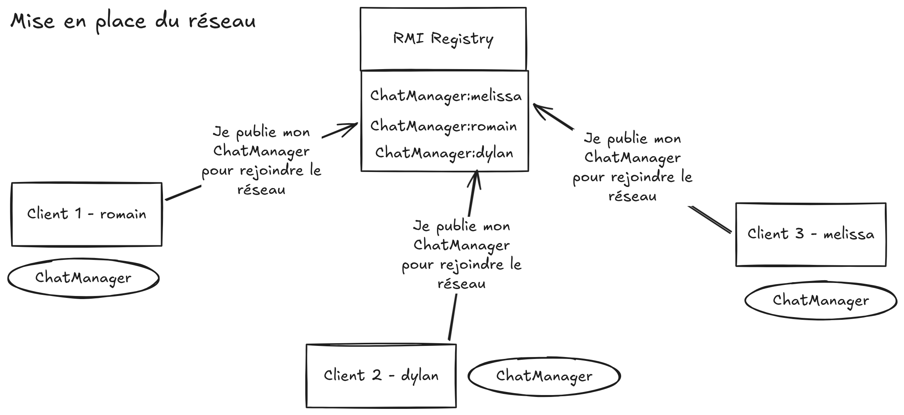
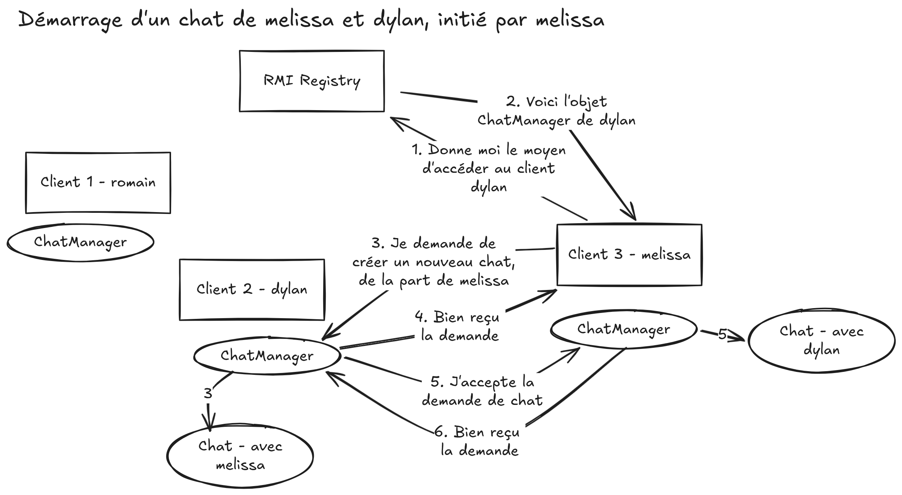
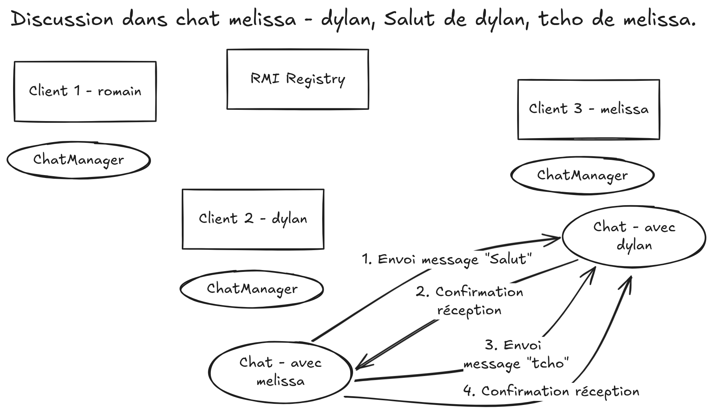
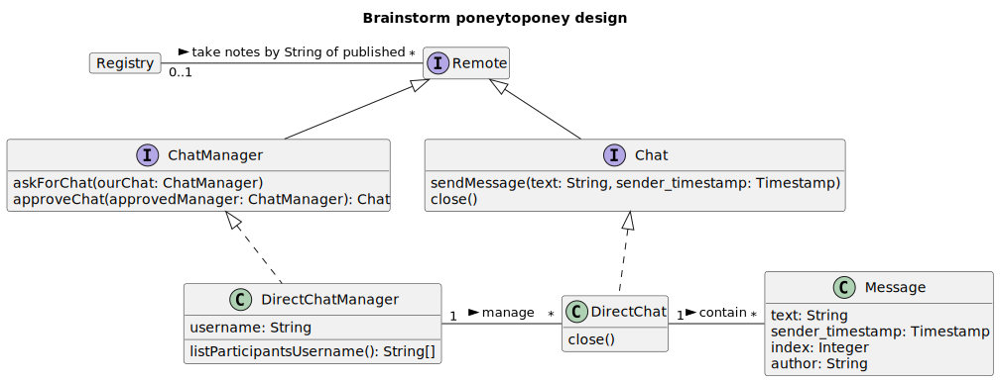

# Notes brainstorming du projet

## Interaction sur le réseau
Pour rejoindre le réseau, chaque client s'est inscrit au RMI Registry pour publier leur ChatManager

TODO: est-ce `ChatManager` devrait pas être `Identity` plutot ??

Processus d'initialisation d'un chat.

Processus d'envoi de message et réponses.

TODO: comment est-ce que les objets Chat vont être récupéré en paramètres et valeur de retours (sur les points 5 et 6) ? sous quel genre de string on les publie au registre ?

## Esquisse de diagramme de classe
Source dans [brainstorm.puml](brainstorm.puml)

TODO: est-ce que les objets messages devront aussi être distribués ?

TODO: est-ce qu'un message doit avoir un `author` sous la forme de référence à un objet distant ? C'est à dire sous la forme du stub de ChatManager (ou Identity) ?

## Concepts

- Un "objet publié" signifié ici qu'il a été exporté/publié/bind sur le registry.
- Un objet distant se compose d'un objet en local qui fait référence à un objet distant, tournant sur un autre autre client. Lors de l'appel d'une méthode de l'objet locale, l'appel est sérialisé, envoyé au client distant en pair à pair, exécutant sur celui-ci, puis le résultat est sérialisé à nouveau, renvoyé au client de départ sur l'objet local.
- Chaque noeud a un objet DirectChatManager, implémentant `ChatManager` qui permet de recevoir et initier des chats avec d'autres
- Chaque noeud a zéro à plusieurs DirectChat qui représentent les discussions en cours
- Une conversation ouverte signifie un objet DirectChat publié présent

TODO: est-ce correct d'avoir 2 objets `DirectChat` ? Est-ce qu'on peut faire en sorte d'en avoir qu'un seul réel ? (un distant réel d'un coté et un stub local de l'autre coté)